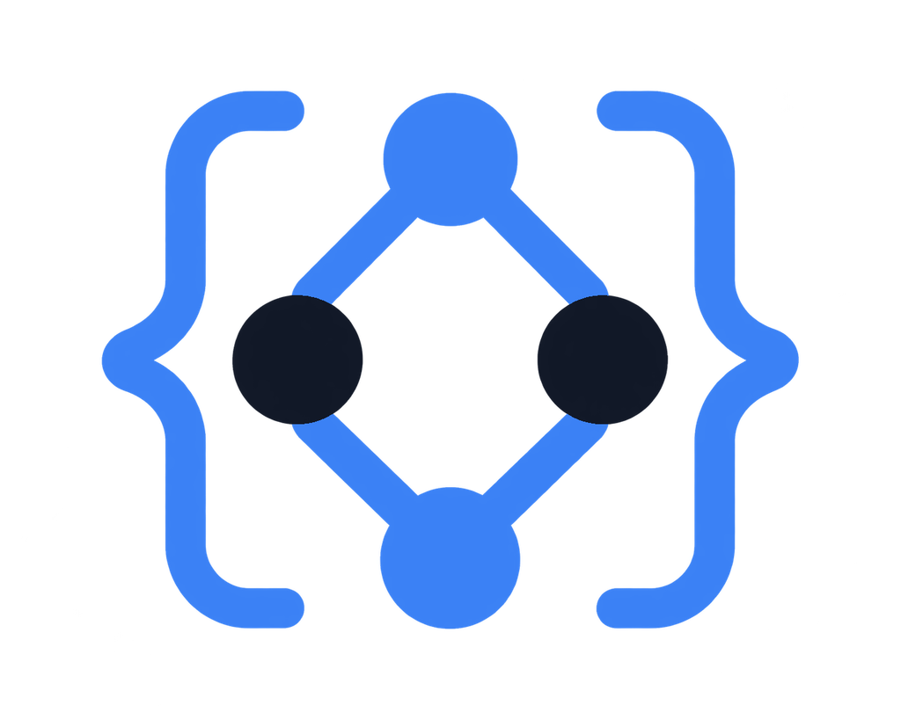

<p align="center">
  <picture>
    <source media="(prefers-color-scheme: dark)" srcset="assets/logo-dark.png">
    
  </picture>
</p>

<h1 align="center">seudesign</h1>

<p align="center">
  <em>Don't read system design. Run it.</em><br>
  A system design skill for Claude Code — design docs, architecture reviews,
  mock interviews, capacity estimation.
</p>

<p align="center">
  
  
  
  
  
  
</p>

<p align="center">
  <sub>English &middot; <a href="README.ko.md">한국어</a> &middot; <a href="README.ja.md">日本語</a> &middot; <a href="README.zh.md">中文</a></sub>
</p>

---

Not a reference doc — a **working skill**. Four modes let your agent design,
diagnose, and interview you. The agent always answers in **your conversation
language** — use it in English, Korean, Japanese, anything.

## Modes

| Command | What it does |
|---|---|
| `/sdp design a chat service` | Requirements interview → estimation → full design doc with diagrams |
| `/sdp review` | Architecture audit of your codebase — SPOFs, missing timeouts, idempotency gaps, as file:line findings |
| `/sdp interview` | Mock system design interview — 3-level hints, rubric scoring |
| `/sdp estimate an image service` | Interactive capacity estimation — RPS/storage + what the numbers mean for your design |

## Install

### Claude Code

```
/plugin marketplace add SeuPut0705/seudesign
```
```
/plugin install sdp@seudesign
```

(Send the two commands as separate prompts.)

### Codex

```bash
codex plugin marketplace add SeuPut0705/seudesign
codex plugin add sdp@seudesign
```

### GitHub Copilot CLI

```bash
copilot plugin marketplace add SeuPut0705/seudesign
copilot plugin install sdp@seudesign
```

### OpenCode / Cursor / AGENTS.md-style agents

Clone the repo and open it — [AGENTS.md](AGENTS.md) is picked up
automatically. For a global install use the script below.

### Anything else (universal)

```bash
curl -fsSL https://raw.githubusercontent.com/SeuPut0705/seudesign/main/install.sh | sh
```

Works for any agent that reads a skills directory. Override the target with
`DEST=path`.

## What's inside

```
skills/sdp/
  SKILL.md                    # 4 mode workflows + decision framework + principles
  references/
    architecture.md           # LB, proxies, CDN, gateways, monolith vs microservices
    data.md                   # DB scaling ladder, sharding, consistent hashing, caching
    async.md                  # queues, delivery guarantees, idempotency, backpressure, outbox
    reliability.md            # availability math, circuit breakers, rate limiting, observability
    networking.md             # DNS, TCP/UDP, RPC vs REST, polling/WebSocket/SSE
    patterns.md               # saga, event sourcing, CQRS, distributed locks, fan-out
    estimation.md             # latency numbers, traffic/storage estimation procedure
    interview.md              # interview playbook, rubric, 6 most common mistakes
    checklists.md             # architecture audit + production readiness checklists
    cases/                    # 5 worked designs
      url-shortener.md        #   ID generation, caching, 301 vs 302
      rate-limiter.md         #   token bucket, fail-open, Redis Lua
      chat-system.md          #   WebSocket state, message ordering, presence
      news-feed.md            #   hybrid fan-out, the celebrity problem
      file-storage.md         #   chunking, dedup, delta sync, conflicts
      web-crawler.md          #   crawl frontier, politeness, Bloom filter dedup
      search-autocomplete.md  #   precomputed top-K, decay weighting, debounce
    templates/
      design-doc.md           #   fixed design-doc output skeleton
agents/
  sdp-reviewer.md             # bundled read-only architecture audit subagent
```

## Design philosophy

- **No premature scaling** — infrastructure patterns only after the bottleneck is proven.
- **Every choice is a trade-off pair** — what you gain and what you give up.
- **No design without numbers** — start from estimates, even rough ones.

## Example

Full sample outputs live in [examples/](examples/) — a design doc and an architecture audit.

```
> /sdp review

Architecture audit (by severity)

| Location | Severity | Symptom | Fix |
|---|---|---|---|
| api/client.py:42 | Critical | requests.get without timeout | timeout=(3,10) + retry budget |
| worker/consume.py:18 | High | non-idempotent consumer on at-least-once queue | processed-ID table + unique constraint |
...
```

## Star History

[](https://star-history.com/#SeuPut0705/seudesign&Date)
