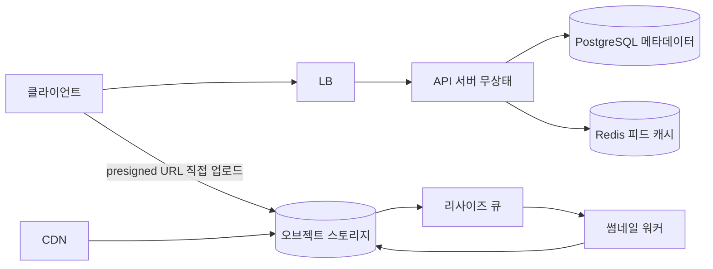

# `/sdp design 이미지 공유 서비스` 출력 예시 (축약)

## 1. 요구사항 (인터뷰 결과)

- 기능: 이미지 업로드, 피드 조회, 좋아요. (검색·필터는 v2로 미룸)
- 비기능: DAU 100만 가정, 업로드 50만 장/일, 조회 2천만 회/일,
  읽기:쓰기 = 40:1, 피드 p99 < 300ms, 이미지 유실 불가.

## 2. 추정

- 조회 2×10^7 / 86,400 ≈ **230 RPS 평균, 피크 ~1,000 RPS**
- 저장: 2MB × 5×10^5/일 × 365 ≈ **365TB/년** (원본) — 오브젝트 스토리지 필수
- 썸네일 3종 × 100KB → 55TB/년, CDN 캐시 대상

## 3. 고수준 설계

- 업로드: API는 presigned URL만 발급 — 이미지 바이트가 앱 서버를 거치지
  않음 (대역폭 병목 제거).
- 리사이즈는 비동기 — 업로드 응답은 원본 저장 즉시.

## 4. 핵심 상세: 피드

- 읽기 40:1 → fan-out-on-write, 피드 캐시(Redis zset, 이미지 ID만 800개).
- 대안 비교: pull 방식은 조회마다 팔로우 N명 병합 — 이 비율에선 탈락.
  celebrity 등장 전까지는 순수 push로 충분 (하이브리드는 팔로워 10만+
  계정 발생 시 도입).

## 5. 확장 경로와 병목

1. 지금: 앱 2대 + PG 1 + Redis 1 — 피크 1,000 RPS는 캐시 적중 시 여유.
2. 다음 병목 예상: 썸네일 워커 (업로드 피크 시 큐 지연) — 워커 수평 확장,
   큐 깊이 알람.
3. 메타 DB는 연 ~2억 행 — 2년 내 파티셔닝(월별) 검토, 샤딩은 그 뒤.

## 6. 선택 요약

| 선택 | 대안 | 버린 이유 |
|---|---|---|
| presigned 직접 업로드 | 앱 경유 업로드 | 앱 대역폭·메모리 병목, 스케일 비용 |
| fan-out-on-write | on-read | 읽기:쓰기 40:1, 조회 지연 요구 |
| PG + 오브젝트 스토리지 | 문서 DB 단일 | 메타는 관계·트랜잭션 필요, 블롭은 DB에 부적합 |
