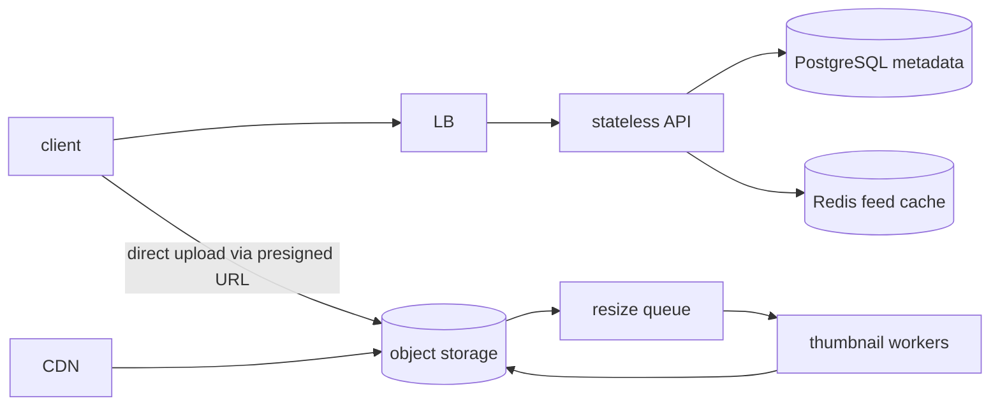

# `/sdp design an image sharing service` sample output (condensed)

## 1. Requirements (from the interview)

- Features: image upload, feed, likes. (Search/filters deferred to v2.)
- Non-functional: 1M DAU assumed, 500k uploads/day, 20M views/day,
  read:write = 40:1, feed p99 < 300ms, no image loss.

## 2. Estimation

- Views 2×10^7 / 86,400 ≈ **230 RPS average, peak ~1,000 RPS**
- Storage: 2MB × 5×10^5/day × 365 ≈ **365TB/year** (originals) — object
  storage mandatory
- 3 thumbnail sizes × 100KB → 55TB/year, CDN-cacheable

## 3. High-level design

- Upload: the API only issues presigned URLs — image bytes never pass
  through app servers (removes the bandwidth bottleneck).
- Resizing is async — the upload response returns at original-persist.

## 4. Deep dive: the feed

- 40:1 reads → fan-out-on-write; feed cache (Redis zset, image IDs only,
  ~800 per user).
- Alternative compared: pull merges N followees per read — loses at this
  ratio. Pure push suffices until celebrity accounts appear (hybrid at
  100k+ followers).

## 5. Scaling path and bottleneck

1. Now: 2 app nodes + 1 PG + 1 Redis — peak 1,000 RPS is comfortable with
   cache hits.
2. Expected next bottleneck: thumbnail workers (queue lag at upload
   peaks) — scale workers horizontally; alert on queue depth.
3. Metadata DB grows ~200M rows/year — revisit partitioning (monthly)
   within 2 years; sharding only after.

## 6. Choices

| Choice | Alternative | Why it lost |
|---|---|---|
| presigned direct upload | upload via app | app bandwidth/memory bottleneck, scaling cost |
| fan-out-on-write | on-read | 40:1 read ratio, feed latency target |
| PG + object storage | single document DB | metadata needs relations/transactions; blobs don't belong in a DB |
