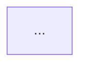

# Design Doc Template (output skeleton for design mode)

Design mode fills this skeleton into a single document. Section order is
fixed — readers must be able to predict where things are.

```markdown
# <System Name> Design

## 1. Requirements

**Functional** (3-5, by priority)
- ...

**Non-functional** (all as numbers)
- DAU / request volume:
- Read:write ratio:
- Latency target (p99):
- Consistency needs: (which data is strong vs eventual)
- Explicit non-goals: (what this design does not cover)

## 2. Capacity Estimation

| Item | Math | Result |
|---|---|---|
| Average RPS | | |
| Peak RPS | ×2-5 | |
| Storage/year | | |

What the estimates decide: (e.g. cache required / single DB viable /
object storage needed)

## 3. High-Level Design



- Name components by role (technologies appear in section 4)
- Describe 1-2 core data flows in prose

## 4. Data Model and API

- Key entities and relationships (only fields that affect the design)
- Core APIs (3-5): method, path, request/response essentials

## 5. Deep Dive: Critical Components

Only the 1-2 riskiest components (traffic concentration, complex state,
blast radius):
- Internal behavior, technology choice + rationale
- Failure scenarios: what if this dies? what if its dependency dies?

## 6. Choices and Trade-offs

| Choice | Alternative | Why it lost |
|---|---|---|

## 7. Scaling Path

1. Now (estimated scale): minimal setup
2. Expected next bottleneck and its signal (which metric, at what value)
3. The fix at that point (not built in advance)

## 8. Open Questions

- Deferred decisions and why they're deferred
```

## Writing rules

- Every section needs numbers and rationale. No "lots of traffic".
- Diagrams in mermaid — text, so they review and version.
- Keep it a 10-minute read — push extra detail to an appendix.
